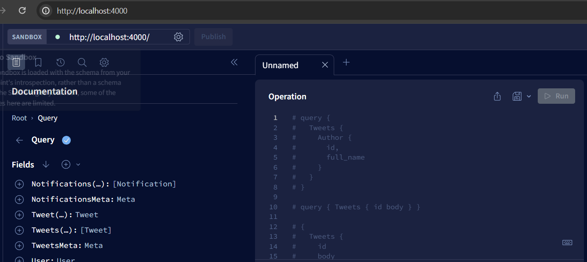
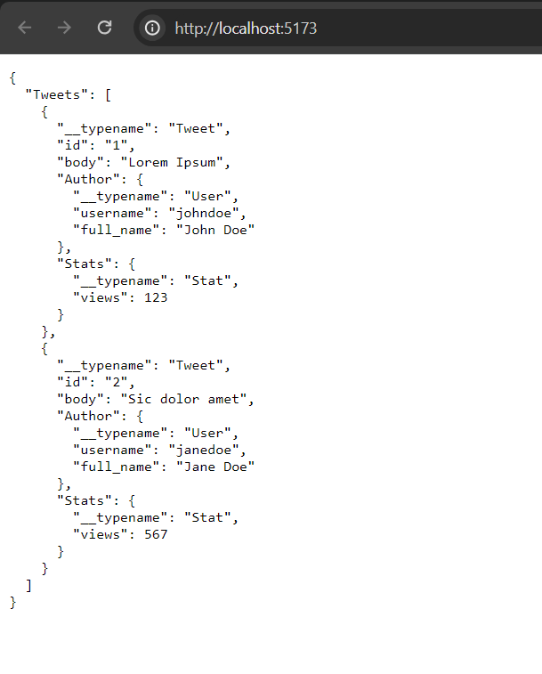

Start the backend (GraphQL) server

`cd backend`

`npm i`

`nodemon server.js`

The GraphQL playground can be accessed at `http://localhost:4000`

Start the client (in another terminal), which connects to the GraphQL endpoint using `ApolloClient`

`cd client`

`npm i`

`npm run dev`

